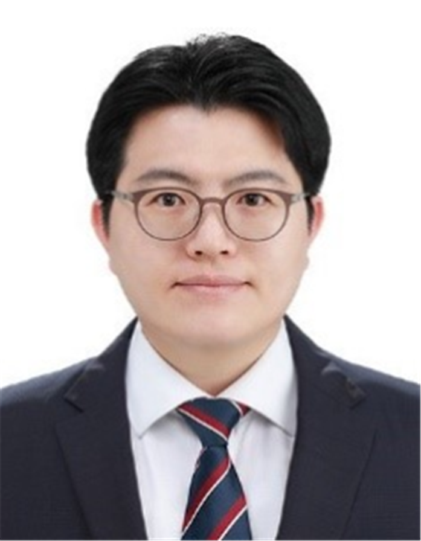
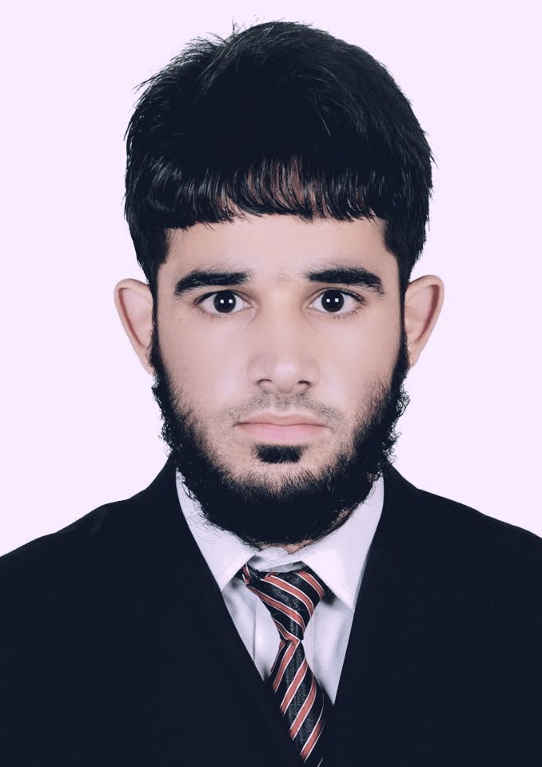
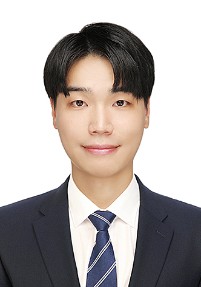
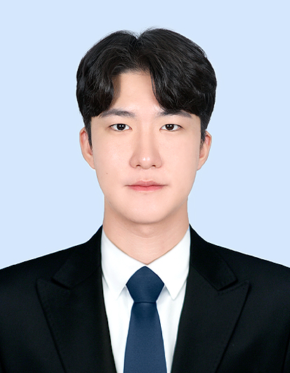
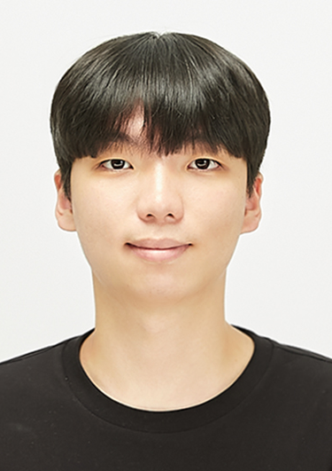

# 🔥 KNUT Algorithmic Machine Intelligence Lab 🔥
 

✨ **KNUT AMI 연구실**(Korea National University of Transportation)은 곽정환 교수님 👨‍🏫의 지도 하에 운영되고 있습니다. 저희 연구실은 **혁신적인 인공지능/머신러닝 기술**을 창의적으로 응용하여 **더 나은 미래를 설계**하는 데 중점을 둔 **매우 혁신적인 연구 프로그램**을 자랑합니다.

🎯 저희의 관심사는 **기본적인 원리를 발견**하고 **새로운 알고리즘**을 제안하는 데 있으며, **고차원 문제를 해결하는 알고리즘 구현**에 초점을 맞추고 있습니다.

🌐 **연구 분야**:
- 🚆 Railway System AI
- ⚡ Electrical Facility AI
- 🧬 Biomedical AI
- 🧠 Machine Unlearning
- 🔄 Normalizing Flow
- 🔍 Explainable AI
- 📝 Large Language Model
- 🐕 Pet HealthCare AI
  
---

# Members

## Professor

<h3>곽정환 (Jeonghwan Gwak)</h3>  

**Affiliation** : Coming Soon  
**Research Area** : Coming Soon  
**E-mail** : jgwak@uc.at.kr  
**Google Scholar** : [📚](https://scholar.google.co.kr/citations?hl=ko&user=S4f2ALkAAAAJ)  
**GitHub**: Coming Soon  

 

## Postdoctoral Researchers

<h3>Naeem Jan</h3>  

**Degree** : PhD in Mathematics  
**Current Position** : Research Scientist  
**Research Area** : Graph Theory, Artificial Intelligence, Fuzzy Sets and Generalizations, Fuzzy Algebra, Theoretical Computer Science  
**E-mail** : naeem.jan.7300@gmail.com  
**Google Scholar** : [📚](https://scholar.google.com/citations?user=N1p49AgAAAAJ&hl=en)  
**GitHub**: Coming Soon  

 

## Ph.D Students

<h3>Hu Xufeng</h3>  

**Major** : Software Engineering  
**Research Area** : Data Classification  
**E-mail** : hxufeng66@gmail.com  
**Google Scholar** : Coming Soon  
**GitHub**: Coming Soon  

 

## Postmaster Students

<h3>Saeed Ahmad</h3>  

**Major** : Artificial Intelligence  
**Research Area** : Image Segmentation, Vision Transformer  
**E-mail** : saeedahmad.icp@gmail.com  
**Google Scholar** : Coming Soon  
**GitHub**: Coming Soon  

 

## Master Students

<h3>김남중 (Namjung Kim)</h3>  

**Major** : Software Engineering  
**Research Area** : Image Segmentation, TimeSeries Data Analysis, MultiModal Data Analysis  
**E-mail** : knj95@kakao.com  
**Google Scholar** : Coming Soon  
**GitHub**: Coming Soon  

 

<h3>박창준 (Changjoon Park)</h3>  

**Major** : AI Robot Engineering  
**Research Area** : Image Segmentation, TimeSeries Data Analysis  
**E-mail** : knj95@kakao.com  
**Google Scholar** : Coming Soon  
**GitHub**: Coming Soon  

 

<h3>박준휘 (Junhwi Park)</h3>  

**Major** : AI Robot Engineering  
**Research Area** : Object Detection, Image Segmentation, YOLO, Image Classification  
**E-mail** : objectdetection@kakao.com  
**Google Scholar** : Coming Soon  
**GitHub**: Coming Soon  

 

<h3>Sharjeel Masood</h3>  

**Major** : Artificial Intelligence  
**Research Area** : Digital Image Processing, Medical Imaging, Deep and Machine Learning  
**E-mail** : sharjeelmasood.sm@gmail.com  
**Google Scholar** : Coming Soon  
**GitHub**: Coming Soon  

 

## Undergraduate Students & Interns

<h3>이재현 (Jaehyun Lee)</h3>  

**Major** : Computer Engineering  
**Research Area** : Image Classification, Optical Flow, Anomaly Detection  
**E-mail** : dlwogus1441@gmail.com  
**Google Scholar** : Coming Soon  
**GitHub**: Coming Soon  

 

---

## 연구 분야

- 인공지능 (AI)
- 알고리즘 설계
- 머신 러닝
- 딥 러닝

---

## 최근 연구 성과

- [연구 성과 1](링크를_넣으세요)
- [연구 성과 2](링크를_넣으세요)
- [연구 성과 3](링크를_넣으세요)

---

## 연락처

- 연구실 위치: [위치 정보]
- 이메일: [이메일 주소]
- 전화번호: [전화번호]

---

## 연구실 GitHub 페이지
[연구실 GitHub 리포지토리](링크를_넣으세요)
